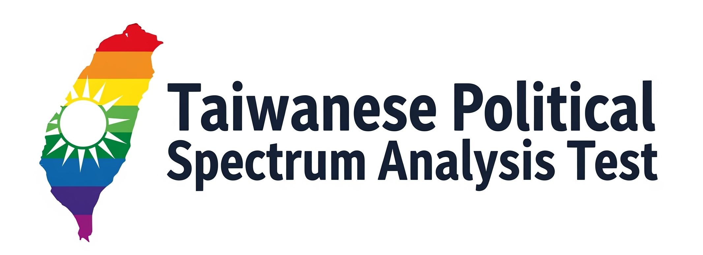

<!DOCTYPE html>
<html lang="zh-Hant">
<head>
  <meta charset="UTF-8">
  <meta name="viewport" content="width=device-width, initial-scale=1">
  <title>台灣政治光譜分析測驗</title>
  <!-- Bootstrap CSS -->
  <link href="https://cdn.jsdelivr.net/npm/bootstrap@5.3.0/dist/css/bootstrap.min.css" rel="stylesheet">
  <!-- Chart.js -->
  
  
</head>
<body>
  

    <!-- 首頁區塊 -->
    

      

        
        <h1>台灣政治光譜分析測驗</h1>
      

      
你好！這是一個幫助你快速了解自己在台灣政治光譜中位置的小工具。測驗共有 20 題，分成六大主題：兩岸與認同、治理與秩序、經濟策略、社會議題、能源與環境，以及反極化與風格。每題請從 1（非常不同意）到 5（非常同意）選擇最符合你意見的分數。完成後，系統將依照你的回答，繪製一張散點圖和一張雷達圖，並給出「深藍、淺藍、中間白、淺綠、深綠」等五種光譜分類，讓你一目了然自己的政治傾向。

      

        <button id="start-btn" class="btn btn-primary btn-lg">Start</button>
      

    

    <!-- 測驗表單 -->
    

      <h2 class="text-center">填寫以下題目（1 = 強烈不同意，5 = 強烈同意）</h2>
      <form id="survey-form">
        <!-- A軸 題目 -->
        

          <h4>A 軸：兩岸與認同</h4>
          

            <label for="q1" class="form-label">1. 我支持在不預設政治前提下恢復或維持兩岸制度性對話，以降低風險。</label>
            <select id="q1" class="form-select" required>
              <option value="">請選擇...</option>
              <option>1</option><option>2</option><option>3</option><option>4</option><option>5</option>
            </select>
          

          <!-- 同結構再添加 q2, q3 題目 -->
        

        <!-- B軸 題目 -->
        

          <h4>B 軸：治理與秩序</h4>
          

            <label for="q4" class="form-label">4. 面對治安與資安風險，我支持政府有強大執行力並可提供申訴管道。</label>
            <select id="q4" class="form-select" required>
              <option value="">請選擇...</option>
              <option>1</option><option>2</option><option>3</option><option>4</option><option>5</option>
            </select>
          

          <!-- 再添加 q5, q6 題目 -->
        

        <!-- C軸 題目 -->
        

          <h4>C 軸：經濟策略</h4>
          <!-- 添加 q7, q8, q9 -->
        

        <!-- D軸 題目 -->
        

          <h4>D 軸：社會議題</h4>
          <!-- 添加 q10, q11, q12 -->
        

        <!-- E軸 題目 -->
        

          <h4>E 軸：能源與環境</h4>
          <!-- 添加 q13, q14, q15 -->
        

        <!-- F軸 題目 -->
        

          <h4>F 軸：反極化與風格</h4>
          <!-- 添加 q16, q17, q18 -->
        

        <!-- 校正題 -->
        

          <h4>校正題</h4>
          <!-- 添加 q19, q20 -->
        

        <button type="submit" class="btn btn-primary mt-3">提交</button>
      </form>
    

    <!-- 頁尾：開發者介紹 -->
    

      本測驗由 Aston 獨立開發，不隸屬於任何政黨或利益團體。測驗結果僅供參考，如需正式政治建議請諮詢專業單位。
    

  

  
</body>
</html>
